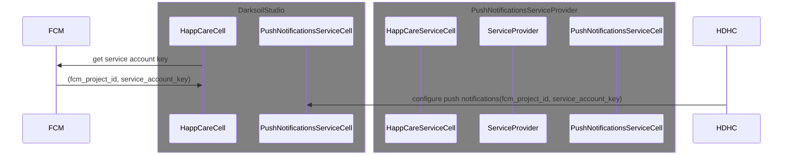
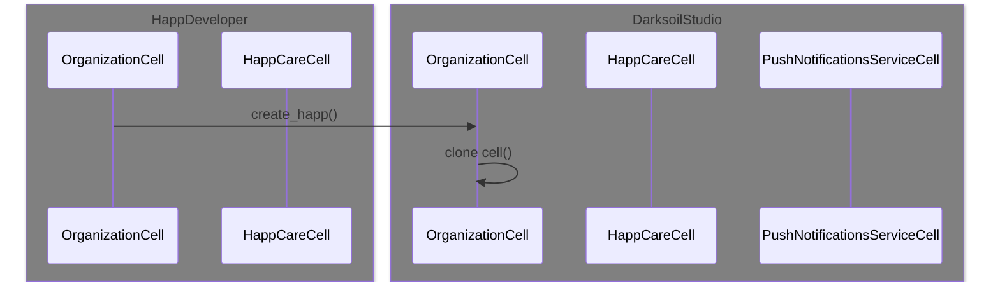
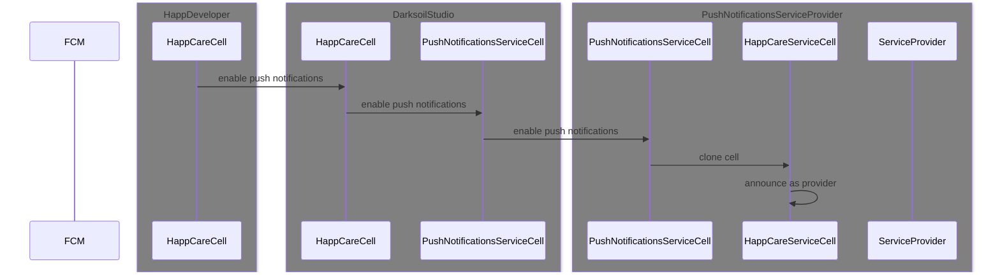
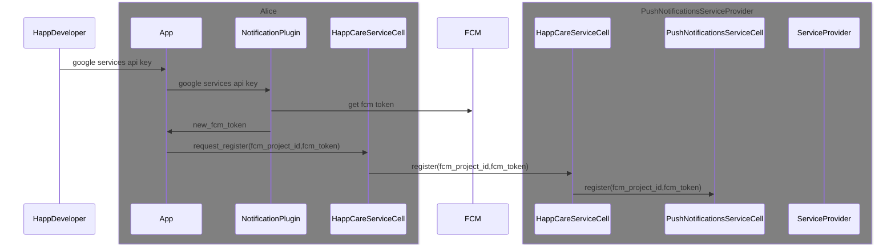
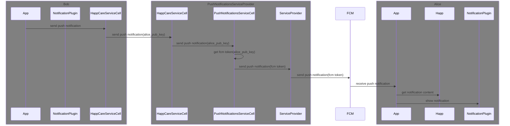

## Darksoil Setup for hApp-care

```mermaid
sequenceDiagram

participant FCM

box grey DarksoilStudio
    participant DSHC as HappCareCell
    participant DSPNS as PushNotificationsServiceCell
end

box grey PushNotificationsServiceProvider
    participant PNSPSC as HappCareServiceCell
    participant PNSP as ServiceProvider
    participant PNSPPNS as PushNotificationsServiceCell
end

DSHC->>FCM: get service account key
FCM->>DSHC: (fcm_project_id, service_account_key)
HDHC->>DSPNS: configure push notifications(fcm_project_id, service_account_key)
```

## hApp-care setup

```mermaid
sequenceDiagram

box grey HappDeveloper
    participant HDOC as OrganizationCell
    participant HDHC as HappCareCell
end

box grey DarksoilStudio
    participant DSOC as OrganizationCell
    participant DSHC as HappCareCell
    participant DSSPNS as PushNotificationsServiceCell
end

HDOC->>DSOC: create_happ()
DSOC->>DSOC: clone cell()

```

## hApp-care enabling push notifications

```mermaid
sequenceDiagram

participant FCM

box grey HappDeveloper
    participant HDHC as HappCareCell
end

box grey DarksoilStudio
    participant DSHC as HappCareCell
    participant DSPNS as PushNotificationsServiceCell
end

box grey PushNotificationsServiceProvider
    participant PNSPPNS as PushNotificationsServiceCell
    participant PNSPSC as HappCareServiceCell
    participant PNSP as ServiceProvider
end

HDHC->>DSHC: enable push notifications
DSHC->>DSPNS: enable push notifications
DSPNS->>PNSPPNS: enable push notifications
PNSPPNS->>PNSPSC: clone cell
PNSPSC->>PNSPSC: announce as provider

```

## Device setup

```mermaid
sequenceDiagram

participant HappDeveloper

box grey Alice
    participant AliceApp as App
    participant ANP as NotificationPlugin
    participant AHSC as HappCareServiceCell
end

participant FCM

box grey PushNotificationsServiceProvider
    participant PNSPSC as HappCareServiceCell
    participant PNSC as PushNotificationsServiceCell
    participant PNSP as ServiceProvider
end

HappDeveloper->>AliceApp: google services api key

AliceApp->>ANP: google services api key
ANP->>FCM: get fcm token
ANP->>AliceApp: new_fcm_token
AliceApp->>AHSC: request_register(fcm_project_id,fcm_token)
AHSC->>PNSPSC: register(fcm_project_id,fcm_token)
PNSPSC->>PNSC: register(fcm_project_id,fcm_token)

```

## Sending a notification

```mermaid
sequenceDiagram

box grey Bob
    participant BobApp as App
    participant BNP as NotificationPlugin
    participant BHSC as HappCareServiceCell
end

box grey PushNotificationsServiceProvider
    participant PNSPSC as HappCareServiceCell
    participant PNSC as PushNotificationsServiceCell
    participant PNSP as ServiceProvider
end

participant FCM

box grey Alice
    participant AliceApp as App
    participant AliceHapp as Happ
    participant ANP as NotificationPlugin
end

BobApp->>BHSC: send push notification
BHSC->>PNSPSC: send push notification(alice_pub_key)
PNSPSC->>PNSC: send push notification(alice_pub_key)
PNSC->>PNSC: get fcm token(alice_pub_key)
PNSC->>PNSP: send push notification(fcm token)

PNSP->>FCM: send push notification(fcm token)
FCM->>AliceApp: receive push notification
AliceApp->>AliceHapp: get notification content
AliceApp->>ANP: show notification

```
