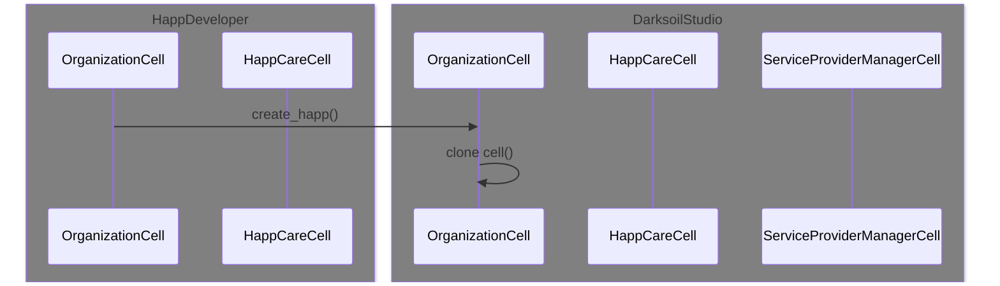
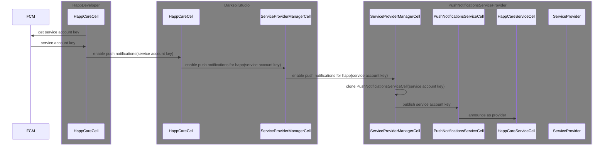
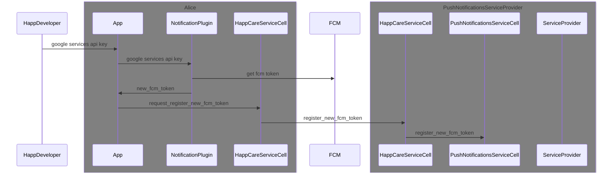
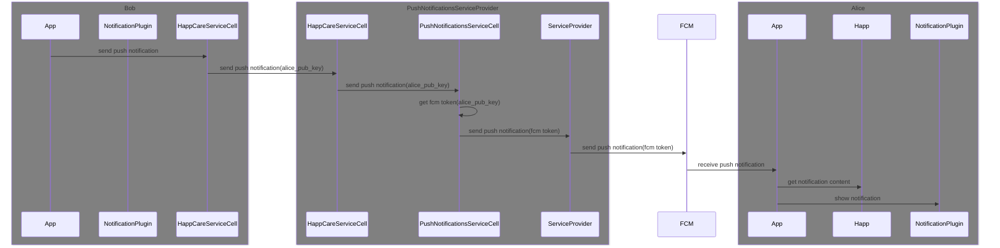

## hApp-care setup

## hApp-care enabling push notifications

Note: each happ has its own PushNotificationsService dna where all the tokens for the users and the services account keys are stored.

## Device setup

## Sending a notification

